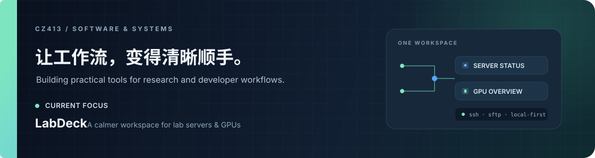

  

<h1 align="center">cz413</h1>

  把复杂的开发流程，做成顺手的工具。 
  I build practical software for research and developer workflows.

  <a href="https://github.com/cz413/LabDeck">LabDeck</a>
  &nbsp;·&nbsp;
  <a href="https://github.com/cz413/juyixiaoxiang">Vue project</a>
  &nbsp;·&nbsp;
  <a href="https://github.com/cz413/Plants-Vs-Zombies">Java project</a>

---

### Currently building

**[LabDeck](https://github.com/cz413/LabDeck)** — a local-first Windows desktop workspace for lab servers and GPUs. Monitor resources, find candidate GPUs, connect over SSH, and move files with SFTP, all from one place.

### What I work with

`TypeScript` · `React` · `Electron` · `Java` · `Vue`

I enjoy turning real workflow friction into focused software: clear status, fewer context switches, and tools that fit the way people already work.

---

Research tools · Developer workflows · Thoughtful software

